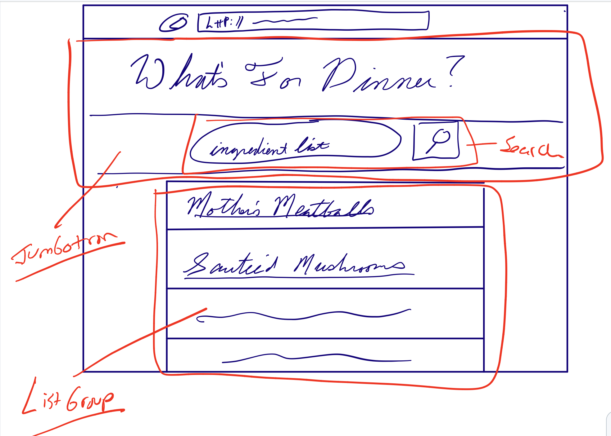

Cat Facts
=========

In modern web applications, communication between the frontend application that is runing on a persons phone, or in their browser and the backend servrer happens using JSON objects.  The server makes several URLs available that the front end can then send requests to in order to retrieve information and update records.

Public API's
================
There are many publically available and free APIs available for us to practice with, and even build into real applications if we choose.  API stands for "Application Programatic Interface".  Below are a few websites you can go to discover them.  For this exersise, we're going to choose an API that doesn't require authentication, and then build a React application around it.

- [Public apis](https://github.com/public-apis/public-apis)
- [APIList.fun](https://apilist.fun)
- [diycode.cc](https://www.diycode.cc/projects/toddmotto/public-apis)


Project Description
======================
We've choosen to build an application around the recipepuppy.com api.  Its a list of recipes that our users will be able to search by ingredients to get ideas about dinner

Planning
============
Let's start with some stories to work on:

- As a user I want to see a list of recipes.
- As a user, I want to be able to enter a comma separated list of ingredients and get a list of recipes back.
- As a user, I want to be able to click on the recipe and be taken to a page with more information.

Perfect,  from there we can draw up a quick wireframe for this application.  We'll be using Bootstrap, so its a good idea to keep the tools Bootstrap provides when laying out the pages.


Getting to work
====================

### Create React App

### Add Bootstrap and react-bootstrap
Find a nice bootstrap theme you would like to use.  For example,  checkout [these](https://bootswatch.com).  Download the bootstrap.min.css file, and put it in your '/public' directory.  Then,  in '/public/index.html', you can add a link to it in the <head> section.

```html
<link rel="stylesheet" href="%PUBLIC_URL%/bootstrap.min.css"/>
```

Now we're ready to add react-boostrap.  From the terminal:

```bash
$ yarn install react-bootstrap
-- OR --
$ npm install react-bootstrap
```


### Main UI Components
Next, let's get the main UI components from our wireframe in place.  If we look through the Bootstrap documentation, we see that a Jumbotron element is almost exactly what we want for the top section, a ListGroup will do nicely for the results.




### Clickable Wireframe
We're going to start hard coding elements on the page to get the UI we want.  Afterwards, we'll fetch live data, and use it to build the page.  Some people call this step a "Clickable Wireframe".  That indicates that all the interactable components are real, but nothing is hooked up yet.


Here's the code to make that happen:
```Javascript
import React from 'react';
import {
	Form,
	Jumbotron,
	Button,
	ListGroup,
} from 'react-bootstrap'

class App extends React.Component {
	render(){
	  return (
	    <div className="App">
				<Jumbotron>
					<div className="d-flex justify-content-center">
						<div className='col-sm-5'>
						  <h1>What's for Dinner?</h1>
						  <p>
								Use the search below to help you with dinner ideas based on what you already have in the kitchen.  Just enter a few ingredients, and get inspired!
						  </p>
							<hr/>
							<h5>Ingredients</h5>
							<div className='form-inline'>
									<Form.Control type="text" placeholder="comman, separated, list" />
						    	<Button variant="outline-primary">Search</Button>
							</div>
						</div>
					</div>

				</Jumbotron>
				<div className="d-flex justify-content-center">
					<div className='col-sm-5'>
						<ListGroup>
						  <ListGroup.Item>Cras justo odio</ListGroup.Item>
						  <ListGroup.Item>Dapibus ac facilisis in</ListGroup.Item>
						  <ListGroup.Item>Morbi leo risus</ListGroup.Item>
						  <ListGroup.Item>Porta ac consectetur ac</ListGroup.Item>
						  <ListGroup.Item>Vestibulum at eros</ListGroup.Item>
						</ListGroup>
					</div>
				</div>j

	    </div>
	  );
	}
}

export default App;
```

### Connect the API
We're now in a good spot to connect with the recipe API.  The first step is to load a sample list of recipes to the page.  Afterwards, we'll hook in the Search feature.

Here's the finished application.  Notice that we switched from using a <ListGroup> to using the Bootstrap element <Card>  It accomplishes the same thing in the UI, and looks nicer:

```Javascript
import React from 'react';
import {
	Card,
	Form,
	Image,
	Jumbotron,
	Button,
	ListGroup,
} from 'react-bootstrap'

class App extends React.Component {
	constructor(props){
		super(props)
		this.state = {
			recipes: [],        //We will wind up with a list of recipes from the API request
			searchValue: ''     //This holds the current value of the search form
		}

		this.getRecipes()     //Kick off a general query so the page loads with recipes
	}

	search = ()=>{          //This is called when the user hits the 'Search' button
		this.getRecipes(this.state.searchValue)
	}

	getRecipes = (q)=>{     //The Main lifting in the app.  We do a fetch, and update the recipes in state.
		this.setState({ recipes: [] })
		const apiKey='a6894f29755de2438c2b9fb553b2931d'
		var searchUrl = "https://www.food2fork.com/api/search?key=a6894f29755de2438c2b9fb553b2931d"

		if(q){                //If the user submitted a search query, pass it along.
			searchUrl = `${searchUrl}&q=${q}`
		}

		fetch(searchUrl)
		.then((resp)=> {
			return resp.json()
		})
		.then( (payload) => {
			const{ recipes } = payload
			this.setState({recipes})     //This is where we update state with the recipe list
		})
		.catch((error) => console.log("Error:", error))
	}
	render(){
	  return (
	    <div className="App">
				<Jumbotron>
					<div className="d-flex justify-content-center">
						<div className='col-sm-5'>
						  <h1>What's for Dinner?</h1>
						  <p>
								Use the search below to help you with dinner ideas based on what you already have in the kitchen.  Just enter a few ingredients, and get inspired!
						  </p>
							<hr/>
							<h5>Ingredients</h5>
							<div className='form-inline'>
									<Form.Control
										type="text"
										placeholder="comman, separated, list"
										onChange={(e)=> this.setState({searchValue: e.target.value})}
										value={this.state.searchValue}
									/>
								<Button onClick={this.search} variant="outline-primary">Search</Button>
							</div>
						</div>
					</div>

				</Jumbotron>
				<div className="d-flex justify-content-center">
					<div className='col-sm-5'>
						{this.state.recipes.map((recipe)=>{
							return(
								<Card>
								  <Card.Img variant="top" src={recipe.image_url} />
								  <Card.Body>
								    <Card.Title>{recipe.title}</Card.Title>
										<a
											href={recipe.source_url}
											className='btn btn-outline-primary'
											target="_blank"
										>
											{recipe.publisher}
										</a>
								  </Card.Body>
								</Card>
							)
						})}
					</div>
				</div>j
	    </div>
	  );
	}
}

export default App;

```
